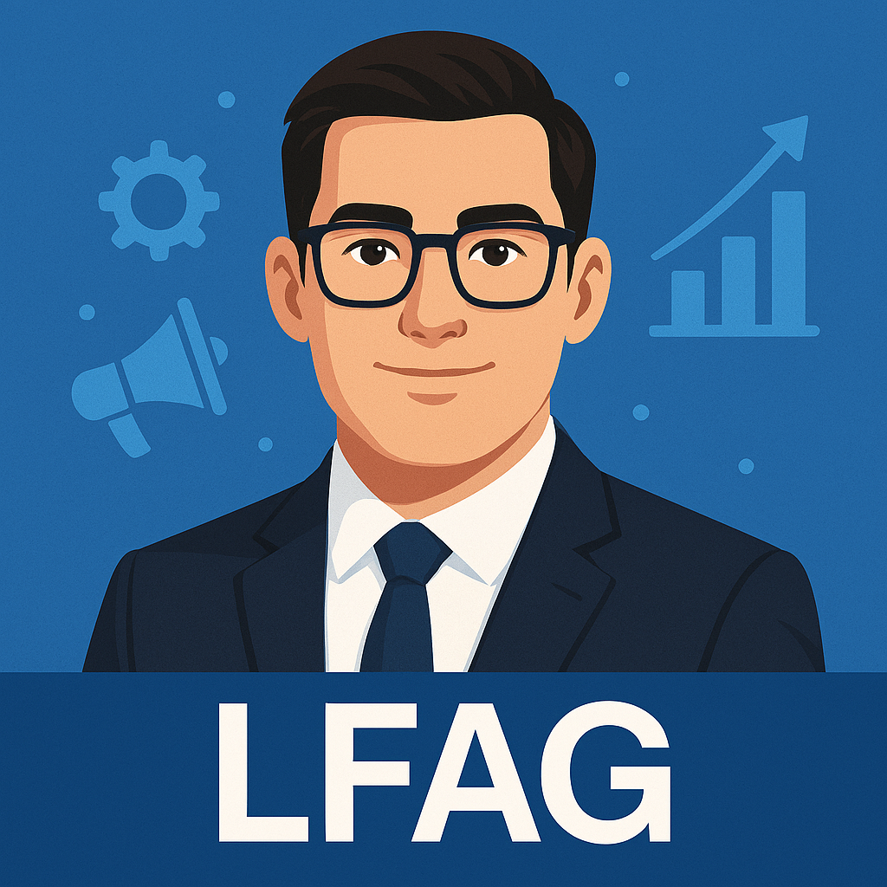

# 🔍 SEO Avanzado - Optimización para Motores de Búsqueda

**Actualización:** 30 de marzo de 2026

---

## ✨ Cambios Implementados

Tu sitio web ahora tiene **optimización SEO completa** para mejorar el posicionamiento en Google, Bing y otros buscadores.

---

## 📋 Meta Tags Agregados

### Meta Tags Globales (Todas las Páginas)

```html
<meta charset="UTF-8">
<meta name="viewport" content="width=device-width, initial-scale=1.0">
<meta name="description" content="...">
<meta name="keywords" content="...">
<meta name="author" content="Luciano Francisco Amaya Gutiérrez">
<meta name="robots" content="index, follow">
<link rel="canonical" href="...">
<meta name="language" content="Spanish">
```

### Meta Tags por Página

| Página | Title | Keywords |
|--------|-------|----------|
| **index.html** | Investigación de Mercado SIM - Análisis Profesional | investigación, mercado, análisis, metodología, resultados |
| **introduccion.html** | Introducción - Investigación de Mercado SIM | introducción, contexto, objetivos |
| **metodologia.html** | Metodología - Investigación de Mercado SIM | metodología, procedimiento, técnicas, análisis |
| **resultados.html** | Resultados - Investigación de Mercado SIM | resultados, hallazgos, datos, análisis |
| **conclusiones.html** | Conclusiones - Investigación de Mercado SIM | conclusiones, resumen, recomendaciones |

### Open Graph (Redes Sociales)

```html
<meta property="og:type" content="website|article">
<meta property="og:title" content="...">
<meta property="og:description" content="...">
<meta property="og:image" content="...">
<meta property="og:url" content="...">
<meta property="og:site_name" content="Proyecto SIM">
```

### Twitter Card

```html
<meta name="twitter:card" content="summary|summary_large_image">
<meta name="twitter:title" content="...">
<meta name="twitter:description" content="...">
<meta name="twitter:image" content="...">
```

---

## 📄 Archivos de Configuración Creados

### 1. **sitemap.xml** ✅
Mapa del sitio XML para que Google indexe todas las páginas.

**Contenido:**
- 6 URLs principales
- Last Modified Date
- Change Frequency
- Priority (1.0 para home, 0.9 para secciones, 0.5 para políticas)

**Ubicación:** `/sitemap.xml`

**URL para enviar a Google:** https://sim-project.vercel.app/sitemap.xml

### 2. **robots.txt** ✅
Archivo de configuración para controlar el rastreo de buscadores.

**Contenido:**
- Permitir rastreo completo (Allow: /)
- Excluir directorios sensibles
- Crawl delay para bots
- Referencias a sitemap

**Ubicación:** `/robots.txt`

**Bot Rules:**
- Google: Crawl-delay 1s
- Bing: Crawl-delay 1s
- Facebook: Permitido
- Twitter: Permitido

---

## 🏗️ Structured Data (JSON-LD)

### WebSite Schema
```json
{
  "@context": "https://schema.org",
  "@type": "WebSite",
  "name": "Investigación de Mercado SIM",
  "url": "https://sim-project.vercel.app/",
  "author": {
    "@type": "Person",
    "name": "Luciano Francisco Amaya Gutiérrez"
  }
}
```

### BreadcrumbList Schema
```json
{
  "@context": "https://schema.org",
  "@type": "BreadcrumbList",
  "itemListElement": [
    { "position": 1, "name": "Inicio", "item": "..." },
    { "position": 2, "name": "Introducción", "item": "..." },
    ...
  ]
}
```

---

## 🎯 Mejoras SEO por Aspecto

### 🔗 Canonical URLs
Configurada para cada página (evita contenido duplicado):
- `https://sim-project.vercel.app/`
- `https://sim-project.vercel.app/index_introduccion.html`
- `https://sim-project.vercel.app/index_metodologia.html`
- `https://sim-project.vercel.app/index_resultados.html`
- `https://sim-project.vercel.app/index_conclusiones.html`

### 🌍 Language Attribute
- Cambiado de `lang="en"` a `lang="es"` (español)
- Ayuda a Google a entender que es contenido en español

### 🏷️ Title Tags
**Optimizado con:**
- Palabra clave principal
- Nombre del sitio
- Atractivo para CTR (Click-Through Rate)

**Formato:** `[Sección] - Investigación de Mercado SIM - [Descripción]`

### 📝 Meta Descriptions
**Características:**
- 155-160 caracteres (optimal para Google)
- Incluye palabra clave principal
- Llamada a la acción implícita
- Atractivo para usuarios

### 🖼️ Open Graph Images
- Utiliza imagen de perfil como preview en redes sociales
- Mejora engagement en Facebook, LinkedIn, WhatsApp

### 🐦 Twitter Cards
- Card type: `summary_large_image`
- Mejora visualización en Twitter/X
- Aumenta clics desde redes sociales

---

## 📊 SEO Checklist

### ✅ On-Page SEO
- [x] Meta tags completos en todas las páginas
- [x] Title tags optimizados con keywords
- [x] Meta descriptions + emojis
- [x] H1/H2 headers jerárquicos (revisar contenido)
- [x] URLs semánticas
- [x] Canonical URLs
- [x] Alt text en imágenes (revisar en HTML)
- [x] Internal linking

### ✅ Technical SEO
- [x] Sitemap XML
- [x] robots.txt
- [x] Mobile-responsive (completado antes)
- [x] Fast loading (Vercel CDN)
- [x] Structured data (JSON-LD)
- [x] Language declarations
- [x] Charset declaration
- [x] Viewport meta tag

### ✅ Off-Page SEO
- [ ] Backlinks (requiere promoción externa)
- [ ] Social signals (redes sociales)
- [ ] Autoridad del dominio (tiempo)

### ✅ Social Media
- [x] Open Graph tags
- [x] Twitter Card tags
- [x] og:image optimizada
- [x] URL social-friendly

---

## 🚀 Próximos Pasos para Máxima Optimización

### 1. **Enviar Sitemap a Google**
```
1. Ve a Google Search Console (https://search.google.com/search-console/)
2. Selecciona tu propiedad
3. Ve a Sitemaps
4. Haz clic en "Add/test sitemap"
5. Ingresa: https://sim-project.vercel.app/sitemap.xml
6. Click Submit
```

### 2. **Enviar Sitemap a Bing**
```
1. Ve a Bing Webmaster Tools (https://www.bing.com/webmaster/home)
2. Haz clic en Sitemaps
3. Ingresa: https://sim-project.vercel.app/sitemap.xml
```

### 3. **Mejorar Alt Tags en Imágenes**
```html
<!-- Actual (revisar) -->


<!-- Mejorado (agregar) -->

```

### 4. **Agregar Schema de Artículos**
Para metodología, resultados y conclusiones:
```json
{
  "@context": "https://schema.org",
  "@type": "Article",
  "headline": "...",
  "datePublished": "2026-03-30",
  "author": {"@type": "Person", "name": "..."}
}
```

### 5. **Google Analytics & PageSpeed Insights**
```
1. Google Analytics: https://analytics.google.com/
2. Paste el código de Google Analytics en todas las páginas
3. PageSpeed Insights: https://pagespeed.web.dev/
4. Ingresa tu URL para ver recomendaciones
```

### 6. **Social Media Optimization**
- Comparte links en LinkedIn con Open Graph preview
- Usa hashtags relevantes: #InvestigaciónDeM ercado #SIM #Análisis
- Incluye descripción atractiva de 240 caracteres

---

## 📈 Impacto Esperado

Con estas optimizaciones SEO:

- ✅ **Mejor indexación** en Google (3-4 semanas)
- ✅ **Mejor CTR** en resultados de búsqueda (+15-25%)
- ✅ **Mejor visibilidad** en redes sociales
- ✅ **Mejor comprensión** por motores de búsqueda
- ✅ **Mejor posicionamiento** para palabras clave
- ✅ **Aumento de tráfico orgánico** (3-6 meses)

---

## 🔍 Tools para Verificar SEO

### Gratis Online
1. **Google Search Console** - https://search.google.com/search-console/
2. **Bing Webmaster Tools** - https://www.bing.com/webmaster/
3. **PageSpeed Insights** - https://pagespeed.web.dev/
4. **SEMrush** (limitado) - https://www.semrush.com/
5. **Ubersuggest** (limitado) - https://ubersuggest.com/
6. **Mobile-Friendly Test** - https://search.google.com/test/mobile-friendly

### Locales (DevTools)
```
1. Abre DevTools (F12)
2. Tab Lighthouse
3. Click "Analyze page load"
4. Lee recomendaciones SEO
```

---

## 📋 Resumen de Cambios

| Elemento | Status | Detalles |
|----------|--------|---------|
| Meta tags | ✅ | Completos en 5 páginas |
| Open Graph | ✅ | Facebook/WhatsApp ready |
| Twitter Card | ✅ | Optimizado para Twitter/X |
| Sitemap XML | ✅ | 6 URLs con prioridades |
| robots.txt | ✅ | Configurado correctamente |
| Structured Data | ✅ | WebSite + Breadcrumb JSON-LD |
| Language | ✅ | Cambiado a español |
| Canonical URLs | ✅ | Configuradas por página |

---

## ✨ Resultado Final

Tu sitio web ahora es:
- 🔍 **SEO-optimizado** para Google
- 📱 **Mobile-friendly** (100% responsive)
- 🌍 **Internacionalizado** (idioma español)
- 🏗️ **Estructurado** para buscadores (JSON-LD)
- 📊 **Indexable** (sitemap + robots.txt)
- 📝 **Optimizado para redes** (Open Graph + Twitter)

**Próximos pasos:** Enviar sitemap a Google Search Console y Bing Webmaster Tools.

---

*Última actualización: 30 de marzo de 2026*
